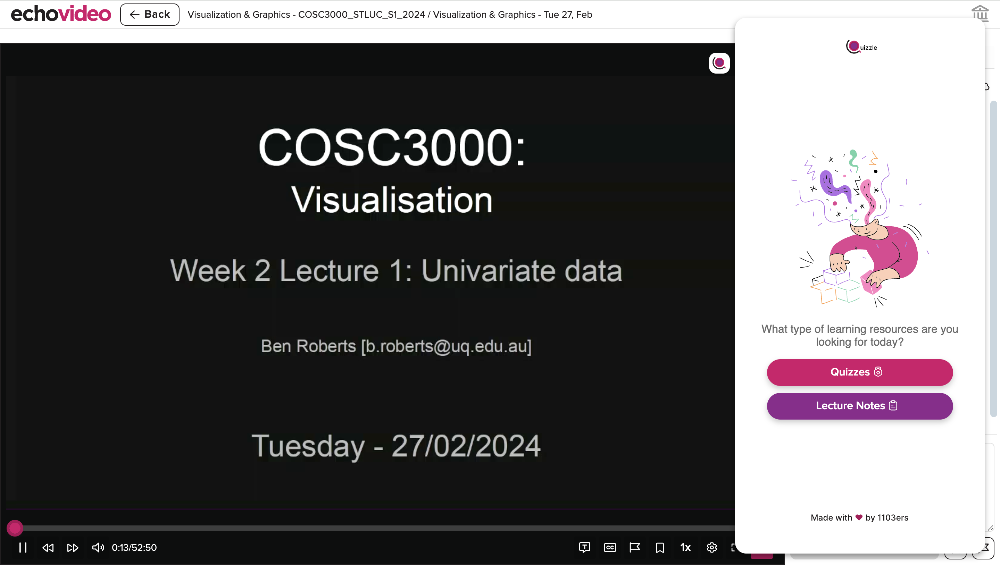
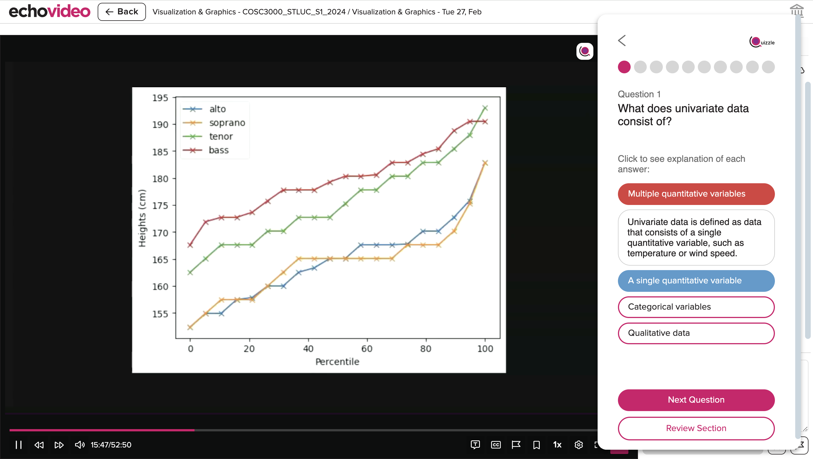

# UQuizzle

Chrome extension designed to assist students with their studies by integrating AI-powered tools directly into the Echo360 video player where the lecture recordings are. The extension offers features such as quiz generation, lecture notes, jump to timestamp for specific topic and performance feedback to help students maximize their learning experience.

## Getting Started

1. Clone this repository to your local machine.
2. Run `npm install`
3. Create `.env` file and put your OpenAI key `REACT_APP_OPENAI_API_KEY`.
4. Run `npm run build`
5. Open Chrome and go to `chrome://extensions/`.
6. Enable "Developer mode" in the top right corner.
7. Click "Load unpacked" and select the build folder.
8. The extension should now be installed and active in your browser.
9. Open Echo360 and lecture recording you'd like watch. The extension should be automatically opened and enjoy playing around with our extension!

## Features

### 1. **Quiz Generation**
Automatically generate quizzes based on the lecture content, where it provide MCQ with timestamps to help students navigate back to specific topic discussed in the lecture.

### 2. **Lecture Notes**
Convert lecture into concise lecture notes that can be downloaded.

### 3. **Feedback on Quiz Performance**
After taking the quiz, students receive detailed feedback highlights the strength and wekaness by each topic. It also provides specific recommendations on areas to improve.

### 4. **Timestamp Navigation**
Each question includes a link to jump back to the relevant timestamp in the lecture where the topic was discussed.

## Screenshots

## AI Usage

The project incorporated the use of AI in several development timeline of the product. During development,AI was used in assisting debugging purposes. Post-development, AI was also used in improving clarity or readability on sentence wordings when appropriate, such as in presentation wordings, etc.
